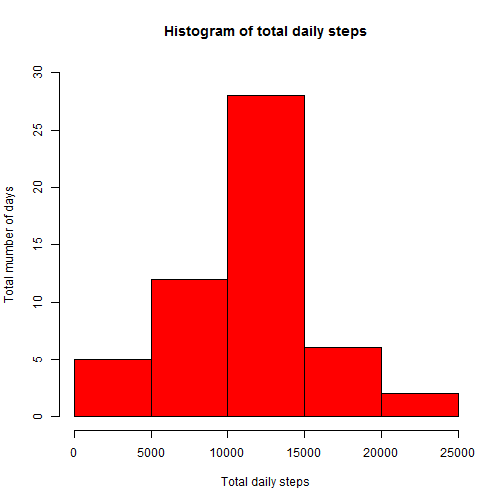
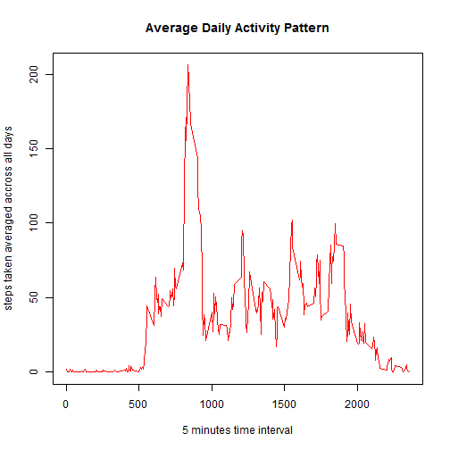
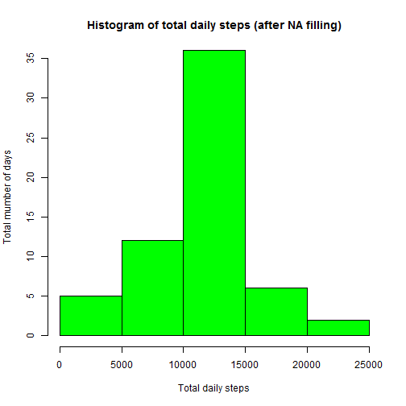
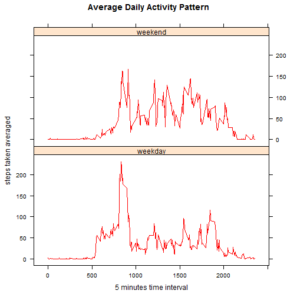

##**Loading and preprocessing the data**


The dataset used in this project has been download from here: [Acitivity Monitoring Data](https://d396qusza40orc.cloudfront.net/repdata%2Fdata%2Factivity.zip) the 14th of May, 2015.

After unziping, load the database into a data.frame, by using *read.csv*:


```r
f_path <- "./Reproducible_Research/activity.csv"
data1 <- read.csv(f_path)
head(data1)
```

```
##   steps       date interval
## 1    NA 2012-10-01        0
## 2    NA 2012-10-01        5
## 3    NA 2012-10-01       10
## 4    NA 2012-10-01       15
## 5    NA 2012-10-01       20
## 6    NA 2012-10-01       25
```

##**What is mean total number of steps taken per day?**

Calculate the total number of steps per day and make and histogram:


```r
sum1 <- tapply(data1$steps,data1$date,sum)
hist(sum1,ylim=c(0,30),main="Histogram of total daily steps",
     xlab="Total daily steps",ylab="Total mumber of days",col="red")
```

 

Calculate the mean and median of the total number of steps taken per day:


```r
mean(sum1,na.rm=TRUE)
```

```
## [1] 10766.19
```

```r
median(sum1,na.rm=TRUE)
```

```
## [1] 10765
```

##**What is the average daily activity pattern?**

Make a time series plot of the 5-minute interval (x-axis) and the average number of steps taken, averaged across all days (y-axis)


```r
data1_mean <- tapply(data1$steps,data1$interval,mean,na.rm=TRUE)
plot(names(data1_mean),data1_mean,col="red",type="l",
     main="Average Daily Activity Pattern",
     xlab="5 minutes time interval",
     ylab="steps taken averaged accross all days")
```

 

The 5-minute interval, on average across all the days in the dataset, that contains the maximum number of steps is computed:


```r
max<-data1_mean[(which.max(data1_mean))]
as.integer(names(max)) # interval
```

```
## [1] 835
```

The number of steps contained is:


```r
max[[1]] # steps
```

```
## [1] 206.1698
```


##**Inputing missing values**

The number of missing values in the dataset (i.e. the total number of rows with NAs) is:


```r
sum(is.na(data1$steps))
```

```
## [1] 2304
```

In order to fill the NA values, the mean for each interval across all days is going to be used to reemplace them:


```r
data2 <- data1 # create a copy of data1
# create a data frame containing  the mean values
x <- data.frame(as.integer(names(data1_mean)),data1_mean) 
names(x) <- c("interval","steps")
p <- merge(data2,x,by="interval") # merge both table
p$date <- as.Date(p$date) # format date
m <- p[order(p$date),] # reorder the merged table to match the original layout
data2[which(is.na(data2$steps)),"steps"] <- 
        m[which(is.na(data2$steps)),"steps.y"] # reemplace mean values in NAs
```

The new data set no longer contains NAs:


```r
head(data2)
```

```
##       steps       date interval
## 1 1.7169811 2012-10-01        0
## 2 0.3396226 2012-10-01        5
## 3 0.1320755 2012-10-01       10
## 4 0.1509434 2012-10-01       15
## 5 0.0754717 2012-10-01       20
## 6 2.0943396 2012-10-01       25
```

With this new dataset, the total number of steps taken per day is calculated again and shown in the next histogram:


```r
data2_mean <- tapply(data2$steps,data2$date,sum)

hist(data2_mean,ylim=c(0,35),
     main="Histogram of total daily steps (after NA filling)",
     xlab="Total daily steps",ylab="Total mumber of days",col="green")
```

 

As it can be seen, replacing NAs values by interval mean values has an overall effect of increasing the number of days with a total value of step
taken in the range that contains the mean (10,000 - 15,000).

For this "fixed" dataset the mean and the median are:


```r
mean(data2_mean)
```

```
## [1] 10766.19
```

```r
median(data2_mean)
```

```
## [1] 10766.19
```

The mean has not changed because NAs values where present in complete days.
After replacing values by means, these previous "empty days" now have a mean
equal to the total mean computed when ignoring (NAs). Therefore, after replacing there are no deviations for the mean computed in the 1st section.

However, the median has changed and know is equal to the mean. These is
because as stated before, the overall effect of this replacing is introducing days whose mean is equal to the total mean allong all days.

##**Are there differences in activity patterns between weekdays and weekends?**

Create a new factor variable in the dataset with two levels - "weekday" and "weekend" indicating whether a given date is a weekday or weekend day:


```r
Sys.setlocale("LC_TIME", "English") # set date variables in English
```


```r
data2$date<-as.Date(data2$date) # date format
Sys.setlocale("LC_TIME", "English") # set date variables in English
```

```
## [1] "English_United States.1252"
```

```r
# create a new column "weekdate" containing weekday and weekend tags
data2$weekdate<-weekdays(data2$date)
data2[data2$weekdate=="Saturday" | data2$weekdate=="Sunday","weekdate"]<-"weekend"
data2[data2$weekdate!="weekend","weekdate"]<-"weekday"
```

Make a panel plot containing a time series plot of the 5-minute interval (x-axis) and the average number of steps taken, averaged across all weekday days or weekend days (y-axis). Laticce package has been used:


```r
tab<-aggregate(steps~weekdate+interval,data2,mean)
library(lattice)
xyplot(steps ~ interval | weekdate,
       layout=c(1, 2),main="Average Daily Activity Pattern",
       xlab="5 minutes time interval",ylab="steps taken averaged",
       type="l",data=tab,col="red")
```

 

